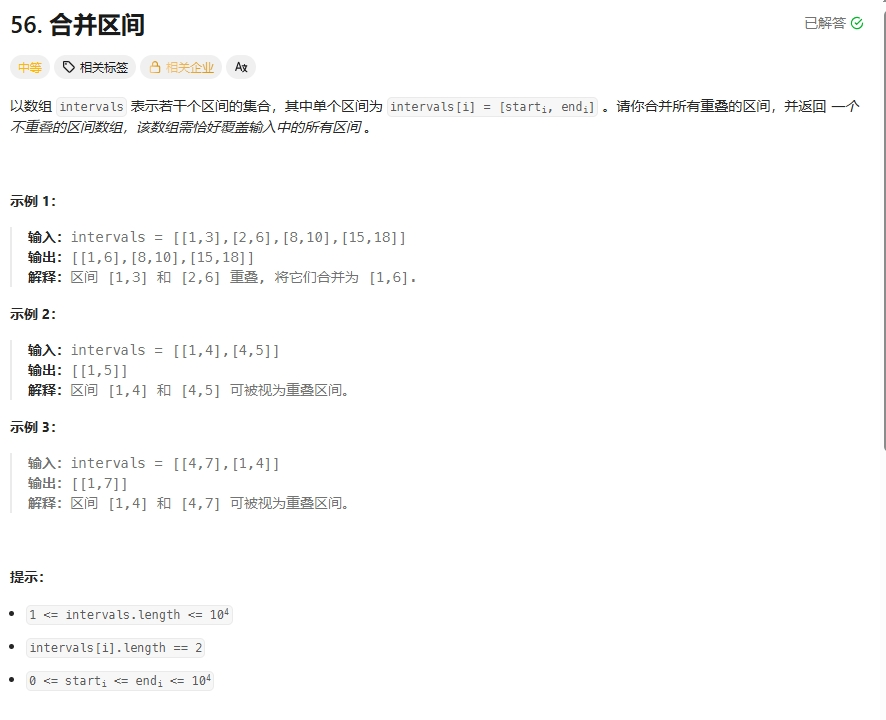

# 力扣刷题总结：

## 力扣hot100题：

### （1）哈希算法篇：

#### 两数之和：

**题目详情：https://leetcode.cn/problems/two-sum/description/?envType=study-plan-v2&envId=top-100-liked**


##### **两数之和的解题思路：**

###### **第一：暴力解法：**

首先这道题，我们第一时间可以想到使用**两层for循环**来解决题目，通过两层的遍历，让我们能够得到符合题目的下标组合。

**暴力解法的代码如下：**

```python
class Solution:
    def twoSum(self, nums: List[int], target: int) -> List[int]:
        for i in range(len(nums)):		# 遍历两层for循环
            for j in range(i + 1, len(nums)):	# 这里需要从i+1开始，是因为之前的下标已经都计算过了，没有必要再计算一遍。
            	if nums[i] + nums[j] == target:
                    return [i, j]
        return []	# 如果确实没有符合题意的值，就返回空
```

**C++的代码如下：**

```c++
class Solution {
public:
    vector<int> twoSum(vector<int>& nums, int target) {
         unordered_map<int, int> hashtable;
         for(int i = 0; i < nums.size(); ++i){
            auto it = hashtable.find(target - nums[i]);
            if(it != hashtable.end()){
                return {it->second, i};
            }
            hashtable[nums[i]] = i;
         }

        return {};
    }
};
```


✅ 暴力解法分步分析时间复杂度

假设数组的长度为：n = len(nums)

第一步：外层循环

```python
for i in range(n):
```

- `i`从`0`到`n-1`，共执行了**n**次

第二步：内层循环

```python
for j in range(i + 1, n):
```

- 对于每一个`i`，`j`从`i+1`到`n-1`。
- 所以内层循环的执行次数为：
- 当`i = 0`: j 从 1 到 n - 1 -> 执行 `n-1`次
- 当 `i = 1`：j 从 2 到 n-1 → 执行 `n-2` 次
- 当 `i = 2`：j 从 3 到 n-1 → 执行 `n-3` 次
- ...
- 当 `i = n-2`：j 从 n-1 到 n-1 → 执行 `1` 次
- 当 `i = n-1`：j 从 n 到 n-1 → 不执行（0 次）

所以内存循环总共执行次数是：

```
(n - 1) + (n - 2) + (n - 3) + ... + 1 + 0
```

这是一个等差数列求和：
$$
\sum_{k = 1}^{n-1}k = \frac{(n - 1) \cdot n}{2} = \frac{n^2 - n}{2}
$$
第三步：每次内层循环中的操作

```python
if nums[i] + nums[j] == target:    
	return [i, j]
```

- 这是一个比较常规的操作，时间复杂度是O(1)。

✅ 暴力解法总体时间复杂度

总的操作次数 ≈ 
$$
\frac{n^2 - n}{2}
$$
我们只关心最高次项和增长趋势，忽略常数和低次项： 
$$
\frac{n^2 - n}{2} \Rightarrow O(n^2)
$$
✅ 所以总的时间复杂度是：O(n)。


###### 第二：哈希表解法：

第二：哈希表解法： 前面我们提到过，用暴力解法确实可以解决问题，但是时间复杂度比较高，所以我们需要利用哈希表（字典）[^hashtable] 来解决问题

哈希表解法的代码如下：

```python
class Solution:
    def twoSum(self, nums: List[int], target: int) -> List[int]:
        summary = {}  # 哈希表，以nums的值作为键，以nums的键作为值
        for i in range(len(nums)):
            num = target - nums[i]      # 计算每一个索引的符合题意的值
            if num in summary:      # 如果有一个刚好在哈希表中，就返回结果
                return [summary[num], i]
            else:       # 如果没有，就将这个结果放在哈希表里面
                summary[nums[i]] = i

        return []       # 如果没有返回空

    
```

⏱️ 哈希表的时间复杂度详细分析

第一层：外层`for`循环：

n = len(nums)

```python
for i in range(n):
```

- 数组长度为 `n`，所以这个循环会执行 **n 次**。
- 每次执行是常数时间 O(1)，所以总循环框架是 **O(n)**。

第二层：内部操作（循环体内）

我们观察每一次的循环操作：

```python
num = target - nums[i]      # 一次减法运算 → O(1)
if num in summary:      # 查询一个键是否在字典中（key in dict）的平均时间复杂度是 O(1)。因为哈希函数直接计算出内存地址，不需要遍历
	return [summary[num], i]	# 查字典 summary[num] → O(1)，构造列表并返回 → O(1)，所以总体的时间是：O(1)
else:       # 如果没有，就将这个结果放在哈希表里面
	summary[nums[i]] = i		# 向字典插入一个键值对 → 平均 O(1)
```

✅ 所以此行耗时：**O(1)**

✅ 综合分析：总时间复杂度

| 操作                        | 每次耗时 | 执行次数  | 总耗时              |
| --------------------------- | -------- | --------- | ------------------- |
| 外层循环                    | ——       | n 次      | n × O(1) = **O(n)** |
| 计算 complement             | O(1)     | n 次      | O(n)                |
| 查询 `num in summary`       | O(1)     | n 次      | O(n)                |
| 插入 `summary[nums[i]] = i` | O(1)     | 最多 n 次 | O(n)                |
| `return` 语句               | O(1)     | 最多 1 次 | O(1)                |

📌 哈希表的**总时间复杂度 = O(n)**


📊 三、哈希表为什么比暴力法快？

| 方法             | 时间复杂度 | 关键操作                             |
| ---------------- | ---------- | ------------------------------------ |
| 暴力法（双循环） | O(n²)      | 每个元素都要和其他所有元素配对       |
| 哈希表法         | **O(n)**   | 每个元素只访问一次，查询靠哈希表加速 |

**总结：**

这道题最好用**哈希表**的方法完成， 用**暴力解法**也可以，但是时间复杂度不够理想。

------


#### 字母异位词分组

题目链接：https://leetcode.cn/problems/group-anagrams/description/?envType=study-plan-v2&envId=top-100-liked


**解题思路：**

其实这个题目的解题思路不算很难，主要是要理解题目的意思，它的意思就是【把字母数量相同的字符串分到一组】，示例：["nat","tan"]都是一个a，一个n，一个t，所以分到一组。["ate","eat","tea"]都是一个a，一个e，一个t，所以分到一组。

##### 🔹思路步骤：

1. 遍历每个字符串；
2. 对字符串排序，得到标准化形式（例如 `"eat"` → `"aet"`）；
3. 用这个排序后的字符串作为 key，把所有异位词放进同一个列表；
4. 最后返回所有分组的列表。

**Python代码如下：**

```Python
from typing import List
import collections;
class Solution:
    def groupAnagrams(self, strs: List[str]) -> List[List[str]]:
        res = collections.defaultdict(list)     # 设置内置列表变量的字典
        for s in strs:
            tmp = ''.join(sorted(s))
            res[tmp].append(s)
        
        return list(res.values())       # 转换为列表格式
```


**C++代码如下：**

```c++
class Solution {
public:
    vector<vector<string>> groupAnagrams(vector<string>& strs) {
        vector<vector<string>> ans;
        unordered_map<string, vector<string>> hashtable;        // 以异位词为键，符合异位键的列表为值的哈希表
        for(auto &str : strs){
            string res = str;
            sort(res.begin(), res.end());       // 进行排序，获得他们的共同点
            hashtable[res].emplace_back(str);   // 将该字符串加入到这个共同点的列表中。
        }
        
        for(auto it = hashtable.begin(); it != hashtable.end(); it++){
            ans.emplace_back(it->second);
        }
        return ans; 
    }
};       
```


🧪 示例运行

```
print(Solution().groupAnagrams(["eat", "tea", "tan", "ate", "nat", "bat"]))
```

输出结果：

```
[['eat', 'tea', 'ate'], ['tan', 'nat'], ['bat']]
```

------

🧱 复杂度分析

| 项目       | 分析                                                        |
| ---------- | ----------------------------------------------------------- |
| 时间复杂度 | O(n·klogk)，其中 n 是字符串数量，k 是单个字符串长度（排序） |
| 空间复杂度 | O(n·k)，用于存储哈希表结果                                  |

------


#### 最长连续序列：

题目链接：

https://leetcode.cn/problems/longest-consecutive-sequence/description/?envType=study-plan-v2&envId=top-100-liked


**方法一：哈希表**
思路和算法

我们考虑枚举数组中的每个数 x，考虑以其为起点，不断尝试匹配 x+1,x+2,⋯ 是否存在，假设最长匹配到了 x+y，那么以 x 为起点的最长连续序列即为 x,x+1,x+2,⋯,x+y，其长度为 y+1，我们不断枚举并更新答案即可。

对于匹配的过程，暴力的方法是 O(n) 遍历数组去看是否存在这个数，但其实更高效的方法是用一个哈希表存储数组中的数，这样查看一个数是否存在即能优化至 O(1) 的时间复杂度。

仅仅是这样我们的算法时间复杂度最坏情况下还是会达到 O(n^2)（即外层需要枚举 O(n) 个数，内层需要暴力匹配 O(n) 次），无法满足题目的要求。但仔细分析这个过程，我们会发现其中执行了很多不必要的枚举，如果已知有一个 x,x+1,x+2,⋯,x+y 的连续序列，而我们却重新从 x+1，x+2 或者是 x+y 处开始尝试匹配，那么得到的结果肯定不会优于枚举 x 为起点的答案，因此我们在外层循环的时候碰到这种情况跳过即可。

那么怎么判断是否跳过呢？由于我们要枚举的数 x 一定是在数组中不存在前驱数 x−1 的，不然按照上面的分析我们会从 x−1 开始尝试匹配，因此我们每次在哈希表中检查是否存在 x−1 即能判断是否需要跳过了。

作者：力扣官方题解
链接：https://leetcode.cn/problems/longest-consecutive-sequence/solutions/276931/zui-chang-lian-xu-xu-lie-by-leetcode-solution/
来源：力扣（LeetCode）
著作权归作者所有。商业转载请联系作者获得授权，非商业转载请注明出处。

代码如下：

```python
class Solution:
    def longestConsecutive(self, nums: List[int]) -> int:
        longest_streak = 0
        num_set = set(nums)

        for num in num_set:
            if num - 1 not in num_set:
                current_num = num
                current_streak = 1

                while current_num + 1 in num_set:
                    current_num += 1
                    current_streak += 1

                longest_streak = max(longest_streak, current_streak)

        return longest_streak
```

**方法二：哈希表“区间合并”法**

这个思路有点像并查集（Union-Find），但用哈希表动态维护“每个连续区间的长度”。

思路：

- 遍历每个数字；
- 如果相邻的数字已经出现过，就**把它们连接成一个连续区间**；
- 每次更新这个区间的左右边界对应的长度。

python代码如下：

```python
class Solution:
    def longestConsecutive(self, nums: List[int]) -> int:
        if not nums:		# 如果列表没有数字，就返回0
            return 0
        length_map = {}		# 哈希字典，用来记录“某个数字所对应的连续区间长度”。但关键是只有区间的边界（或刚插入的数字）会被维护为正确区间长度。
        longest = 0

        for num in nums:	# 跳过已经处理过的数字
            if num not in length_map:
                # 获取左右相邻的区间长度
                left = length_map.get(num - 1, 0)	# 如果 num-1 在 length_map，left = length_map[num-1] 表示左侧相邻区间的长度，如果没有就赋值为0
                right = length_map.get(num + 1, 0)
                curr_len = left + right + 1			# 合并后区间的长度 = 左边区间长度 + 当前数字 1 + 右边区间长度。
                length_map[num] = curr_len
                # 更新左右边界的区间长度
                length_map[num - left] = curr_len
                length_map[num + right] = curr_len
                longest = max(longest, curr_len)

        return longest
```

C++代码如下：

```c++
#include <unordered_map>
#include <vector>
#include <algorithm>
using namespace std;

class Solution {
public:
    int longestConsecutive(vector<int>& nums) {
        if (nums.empty()) return 0;

        unordered_map<int, int> num_map; // 存储每个数字所在连续区间的长度
        int longest = 0;

        for (int num : nums) {
            // 如果当前数字还没被处理
            if (!num_map.count(num)) {
                int left = num_map.count(num - 1) ? num_map[num - 1] : 0;
                int right = num_map.count(num + 1) ? num_map[num + 1] : 0;
                int curr_len = left + right + 1;

                // 记录当前数字的长度
                num_map[num] = curr_len;

                // 更新区间左右边界的长度
                num_map[num - left] = curr_len;
                num_map[num + right] = curr_len;

                // 更新最大长度
                longest = max(longest, curr_len);
            }
            // 如果 num 已存在，就跳过
        }

        return longest;
    }
};
```


------

### （4）子串篇：


#### 滑动窗口的最大值

题目链接：

https://leetcode.cn/problems/sliding-window-maximum/description/?envType=study-plan-v2&envId=top-100-liked


------

#### 两数相加（2）：

##### **官方题解：**

**思路与算法**

由于输入的两个链表都是逆序存储数字的位数的，因此两个链表中同一位置的数字可以直接相加。我们同时遍历两个链表，逐位计算它们的和，并与当前位置的进位值相加。具体而言，如果当前两个链表处相应位置的数字为 n1,n2，进位值为 carry，则它们的和为 n1+n2+carry；其中，答案链表处相应位置的数字为 (n1+n2+carry) mod10，而新的进位值为 ⌊ 101+n2+carry ⌋。如果两个链表的长度不同，则可以认为长度短的链表的后面有若干个 0 。此外，如果链表遍历结束后，有 carry>0，还需要在答案链表的后面附加一个节点，节点的值为 carry。

作者：力扣官方题解
链接：https://leetcode.cn/problems/add-two-numbers/solutions/435246/liang-shu-xiang-jia-by-leetcode-solution/
来源：力扣（LeetCode）
著作权归作者所有。商业转载请联系作者获得授权，非商业转载请注明出处。

**代码如下：**

```c++
/**
 * Definition for singly-linked list.
 * struct ListNode {
 *     int val;
 *     ListNode *next;
 *     ListNode() : val(0), next(nullptr) {}
 *     ListNode(int x) : val(x), next(nullptr) {}
 *     ListNode(int x, ListNode *next) : val(x), next(next) {}
 * };
 */
class Solution {
public:
    ListNode* addTwoNumbers(ListNode* l1, ListNode* l2) {
        ListNode *head = nullptr, *tail = nullptr;  // 设置头结点和尾结点
        int carry = 0;
        while(l1 || l2){        // 当l1和l2的当前指针都为空时，停止循环
            int n1 = l1 ? l1->val : 0;
            int n2 = l2 ? l2->val : 0;
            int sum = n1 + n2 + carry;
            if(!head){      // 如果结果链表为空（即 head 为 nullptr），则创建第一个节点，并将 head 和 tail 均指向该节点。节点的值为 sum % 10，即和的个位数。
                head = tail = new ListNode(sum % 10);
            }else{
                tail->next = new ListNode(sum % 10);
                tail = tail->next;
            }

            carry = sum / 10;   // 获得进位数
            
            if(l1){     // 如果l1不为空，则让它指向下一个结点
                l1 = l1->next;
            }
            if(l2){
                // l2也是同样的道理
                l2 = l2->next;
            }

        }
        if(carry > 0){
            tail->next = new ListNode(carry);
        }

        return head;
    }
};
```


##### **网友的方法：**

免去复杂的边界讨论，不需要考虑最后的进位问题，代码精简易记。

```c++
ListNode* addTwoNumbers(ListNode* l1, ListNode* l2) {
        ListNode* dummy = new ListNode();
        ListNode* curr = dummy;
        int carry = 0;
        while(l1 || l2 || carry) {
            int a = l1 ? l1->val : 0;
            int b = l2 ? l2->val : 0;
            int sum = a + b + carry;
            carry = sum >= 10 ? 1 : 0;
            curr->next = new ListNode(sum % 10);
            curr = curr->next;
            if(l1) l1 = l1->next;
            if(l2) l2 = l2->next;
        }
        return dummy->next;
    }
```

```
/**
 * Definition for singly-linked list.
 * struct ListNode {
 *     int val;
 *     ListNode *next;
 *     ListNode() : val(0), next(nullptr) {}
 *     ListNode(int x) : val(x), next(nullptr) {}
 *     ListNode(int x, ListNode *next) : val(x), next(next) {}
 * };
 */
class Solution {
public:
    ListNode* addTwoNumbers(ListNode* l1, ListNode* l2) {
       ListNode *dummy = new ListNode();    // 初始化哑结点和尾结点
       ListNode *curr  = dummy;
       int carry = 0;   // 设置进位数
       while(l1 || l2 || carry){    // l1和l2和carry都为空时，进行循环
            int a = l1 ? l1->val : 0;  // 如果l1的值为空，则设置当前l1的结点的值为0
            int b = l2 ? l2->val : 0;  // l2也是一个道理
            int sum = a + b + carry;    // 总数等于a+b+carry
            carry = sum >= 10 ? 1 : 0;  // 这里很关键，如果sum大于10，则carry为1，否则为0
            curr->next = new ListNode(sum % 10);    // 在这里头结点并没有初始化，而是初始化了头结点的下一个结点
            curr = curr->next;
            if(l1) l1->next;
            if(l2) l2->next;    

       }
       return dummy->next;  // 由于在之前头结点没有进行定义，定义的是下一个结点，所以我们返回下一个结点
    }
};
```


[77. 组合](https://leetcode.cn/problems/combinations/)

题目如下：

代码如下：

```c++
class Solution {
public:
    vector<vector<int>> combine(int n, int k) {
        vector<vector<int>> result;  // 存储最终的组合结果
        vector<int> combination;     // 当前组合
        backtrack(1, n, k, combination, result);
        return result;
    }

private:
    void backtrack(int start, int n, int k, vector<int>& combination, vector<vector<int>>& result) {
        if (combination.size() == k) {
            result.push_back(combination);  // 当前组合大小等于k，保存该组合
            return;
        }
        for (int i = start; i <= n; ++i) {
            combination.push_back(i);        // 选择元素i
            backtrack(i + 1, n, k, combination, result);  // 递归选择下一个元素
            combination.pop_back();          // 撤销选择
        }
    }
};
```


```c++
class Solution {
private:
    vector<vector<int>> result;
    vector<int> path;
    void backtracking(int n, int k, int startIndex) {
        if (path.size() == k) {
            result.push_back(path);
            return;
        }
        for (int i = startIndex; i <= n - (k - path.size()) + 1; i++) { // 优化的地方
            path.push_back(i); // 处理节点
            backtracking(n, k, i + 1);
            path.pop_back(); // 回溯，撤销处理的节点
        }
    }
public:

    vector<vector<int>> combine(int n, int k) {
        backtracking(n, k, 1);
        return result;
    }
};
```

[^hashtable]: 哈希表 (Hash Table)，又叫散列表，是一种通过“键(key)”快速找到“值(value)”的数据结构。它能做到**平均时间复杂度 O(1)** —— 也就是“无论数据多大，几乎都能一步到位”！🧠 举个生活中的例子：假设你有 1000 个学生的成绩单，每个学生有一个学号和分数。现在老师问你：“学号 1050 的分数是多少？”如果你用暴力的方法从头到尾一个个翻，最坏要翻 1000 次 → 时间复杂度 O(n)，如果你使用哈希表法，你就有一个“学号 → 分数”的映射表，直接问：“1050 对应多少？” → 一瞬间告诉你答案 → 时间复杂度 O(1)。这就是哈希表的威力！


### （5）普通数组篇

##### 合并区间：

题目链接：https://leetcode.cn/problems/merge-intervals/description/?envType=study-plan-v2&envId=top-100-liked



**解题思路：**

首先，需要按照区间的左端点进行排序，在排完序的列表中，可以合并的区间一定是连续的。就像下面的图片一样。标记为蓝色、黄色和绿色的区间分别可以合并成一个大区间，它们在排完序的列表中是连续的。


算法

我们用数组 merged 存储最终的答案。

首先，我们将列表中的区间按照左端点升序排序。然后我们将第一个区间加入 merged 数组中，并按顺序依次考虑之后的每个区间：

如果当前区间的左端点在数组 merged 中最后一个区间的右端点之后，那么它们不会重合，我们可以直接将这个区间加入数组 merged 的末尾；

否则，它们重合，我们需要用当前区间的右端点更新数组 merged 中最后一个区间的右端点，将其置为二者的较大值。

作者：力扣官方题解
链接：https://leetcode.cn/problems/merge-intervals/solutions/203562/he-bing-qu-jian-by-leetcode-solution/
来源：力扣（LeetCode）
著作权归作者所有。商业转载请联系作者获得授权，非商业转载请注明出处。

Python代码如下：

```python
class Solution:
    def merge(self, intervals: List[List[int]]) -> List[List[int]]:
        intervals.sort(key=lambda x: x[0])

        merged = []
        for interval in intervals:
            # 如果列表为空，或者当前区间与上一区间不重合，直接添加
            if not merged or merged[-1][1] < interval[0]:
                merged.append(interval)
            else:
                # 否则的话，我们就可以与上一区间进行合并
                merged[-1][1] = max(merged[-1][1], interval[1])

        return merged

```

**复杂度分析**

时间复杂度：O(nlogn)，其中 n 为区间的数量。除去排序的开销，我们只需要一次线性扫描，所以主要的时间开销是排序的 O(nlogn)。

空间复杂度：O(logn)，其中 n 为区间的数量。这里计算的是存储答案之外，使用的额外空间。O(logn) 即为排序所需要的空间复杂度。

